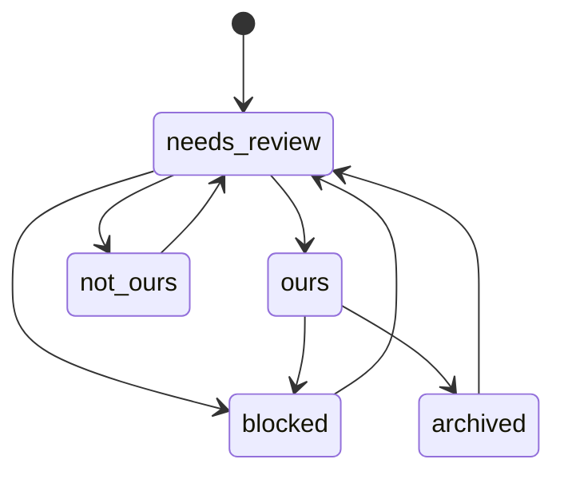
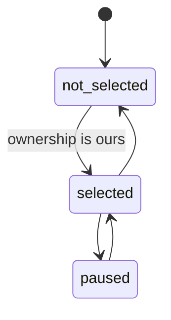
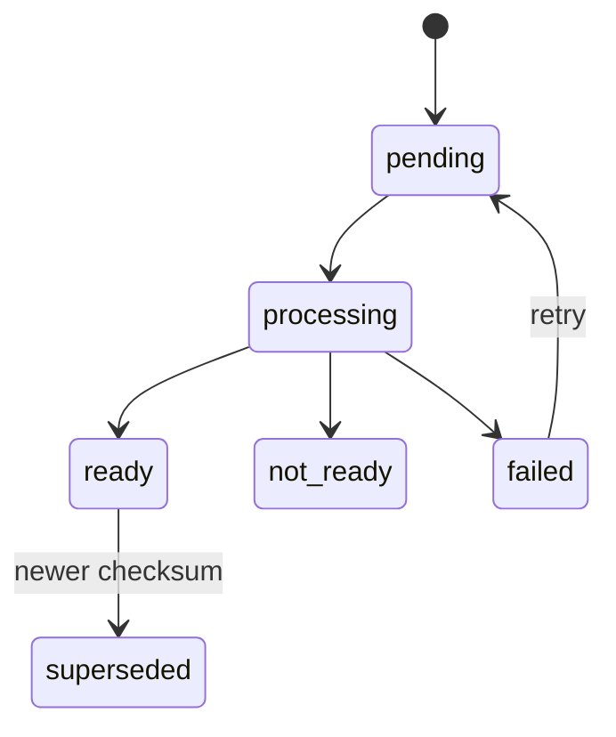
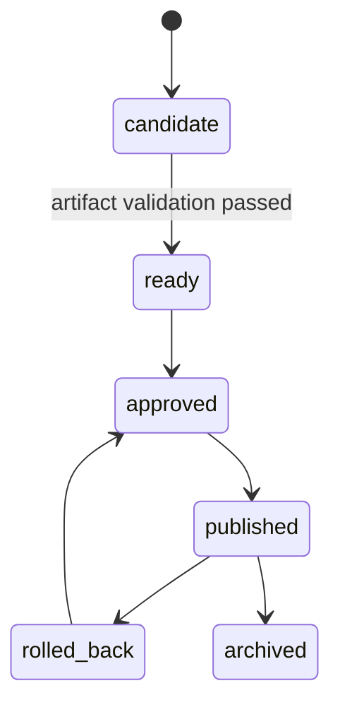

# State Machines

## Candidate Ownership

```mermaid
stateDiagram-v2
  [*] --> needs_review
  needs_review --> ours
  needs_review --> not_ours
  needs_review --> blocked
  ours --> blocked
  ours --> archived
  not_ours --> needs_review
  blocked --> needs_review
  archived --> needs_review
```

## Ingest Selection

```mermaid
stateDiagram-v2
  [*] --> not_selected
  not_selected --> selected: ownership is ours
  selected --> paused
  paused --> selected
  selected --> not_selected
```

## Chapter Artifact

```mermaid
stateDiagram-v2
  [*] --> pending
  pending --> processing
  processing --> ready
  processing --> not_ready
  processing --> failed
  failed --> pending: retry
  ready --> superseded: newer checksum
```

## Publish

```mermaid
stateDiagram-v2
  [*] --> candidate
  candidate --> ready: artifact validation passed
  ready --> approved
  approved --> published
  published --> rolled_back
  published --> archived
  rolled_back --> approved
```
